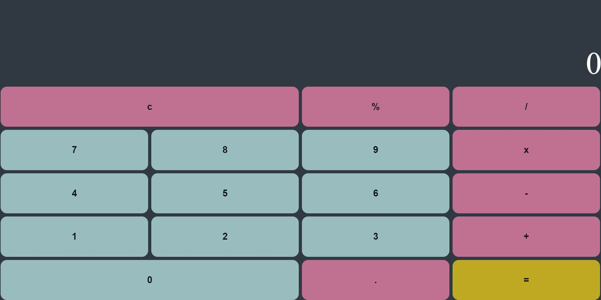

# JavaScript calculator
<p align="center">

</p>
## Table of Contents

- [About](#about)
- [Getting Started](#getting_started)
- [Usage](#usage)
- [To Do](#toDo)

## About <a name = "about"></a>

This calculator project can be used to do simple math equations such as; addition, subtraction, multiply, divide and percentages. I have used Javascript to build this, which has allowed me to use its calling on functions, which wil provide the answers in the display. In the Javascript I have used eventListeners so that when a button is used it will call to a function. That function will then update Variables, these variables are being used by a switch case so that when an operator button is pressed it knows which mathmatical function to call upon. Once the equals button has been clicked it knows to push the results of the equation on to the display.

This is my first javaScript project so when building this I came across some issues. Mostly it was understanding how to have the inputs from clicking the number buttons stored and be able to be used later. Another issue I had was in understanding how to have the switch case use the mathmatical equation and then present that in the display.

## Getting Started <a name = "getting_started"></a>

You can clone down this repo, and deploy it it to a live server. It is also hosted on my GitHub Pages.

### Prerequisites

Run NPM install, to download any neccessary dependencies to run this repo. 

```
 npm install
```

### Testing

cypress is used to test this repo, checking that users can press buttons and come out with a result from the functions created. 

```
describe ("testing if you press another operator without the equals will it do the sum", () => {
  it ("Without pressing the equals button will a sum continue", () => {
    //act
    cy.get('.calcuArea__1').click()
      cy.get('.calcuArea__add').click()
      cy.get('.calcuArea__1').click()
      cy.get('.calcuArea__multiply').click()
      cy.get('.calcuArea__2').click()

    //assert
    cy.get('.calcuArea__display').not("contain", "1 + 1 x 2").should("contain", "1 x 12")
  })
})
```

```
describe("testing if the percentage function works", () => {
  it("Pressing 10 % 100 will present the answer 10 on the display", () => {
    //act 
    cy.get('.calcuArea__1').click()
    cy.get('.calcuArea__0').click()
    cy.get('.calcuArea__percent').click()
    cy.get('.calcuArea__1').click()
    cy.get('.calcuArea__0').click()
    cy.get('.calcuArea__0').click()
    cy.get('.calcuArea__equals').click()
    //asset
    cy.get('.calcuArea__display').should("contain", "10")
  })
})
```

## Usage <a name = "usage"></a>

This repo can be used to create a calculator that will do simple calculations. That can be move towards a more advanced calculator. 

## To Do <a name= "toDo"></a>

I hope to add more features soon such as;
- Being able to continue math functions from the result of an answer.

- Not having to press clear to start a new equation.

- Being able to do more complex equations.

## Contributions

This project was created through my training with the _nology team, so credit for this project can also go to the instructors on the team. I also worked with a collegue Karin which together we worked hard to solve the issues we were having putting together the code for this project.